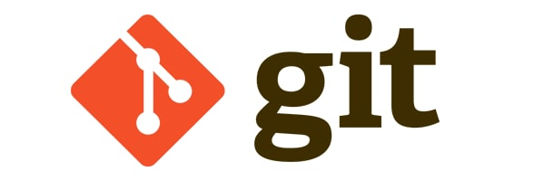
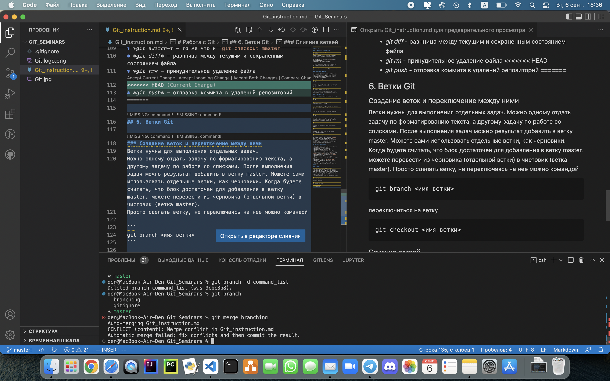

# Работа с Git

## 1. Проверка наличия установленного Git

В терминале выполнить команду 
```
git version
```
Если Git установлен, появится сообщение о установленной версии программы. Иначе будет сообщение об ошибке.

## 2. Установка Git

Загружаем последнюю версию с сайта по [ссылке](https://git-scm.com/downloads).
Устанавливаем с настройками по умолчанию.

## 3. Настройка Git

При первом использовании Git необходимо представиться.
Для этого в терминале нужно ввести две команды:

```
git config --global user.name "<ваше_имя>"
git config --global user.email "<адрес_почты@email.com>"
```

## 4. Инициализация репозитория

Git это система управления версиями. Это значит, что у каждого участника проекта есть своя копия репозитория, которая находиться в папке “.git”, которая расположена в корне проекта. Именно в этой папке хранятся все коммиты и другие объекты Git. Когда мы работаем с Git, он в свою очередь работает с этой папкой.

Новый репозиторий создается командой

```
git init
```

Если мы хотим присоединиться к разработке уже имеющегося проекта, то нужно будет скопировать этот репозиторий в свою локальную папку с удаленного репозитория. Делается это так:

```
git clone <url удаленного репозитория>
```

После чего в текущей папке появляется директория .git в которой и будет содержаться копия удаленного репозитория.

## 5. Процесс работы с Git

После добавления файла в папку проекта нужно зафиксировать изменения. Добавляем файл с помощью команды

```
git add
```

а затем фиксируем изменения с помощью команды
```
commit -m "Комментарий к коммиту"
```  

Когда коммитов накопится достаточно много, чтобы ими можно было поделиться, мы выполняем команду
```
git push
```

После чего наши коммиты уходят в удаленный репозиторий.

Просмотреть коммиты можно при помощи команды

```
git log
```

Что бы закончить просмотр нужно нажать на клавишу q.

Формат ответа этой команды не очень удобен. Вот такая команда выведет ответ в более читаемом виде

```
git log --oneline
```

Посмотреть, что находиться в рабочей директории можно командой

```
git status
```

Рабочую директорию можно переключить на предыдущее состояние выполнив команду

```
git checkout <hash коммита> 
```

Только перед тем как это делать, выполните `git status` и убедитесь, что у вас нет никаких локальных и не зафиксированных изменений. Иначе Git не поймет, как ему переключаться. `git status` подскажет вам что можно сделать с локальными изменениями что бы можно было переключиться. Этого правила следует придерживаться и при всяких других переключениях рабочей области.

### Необходимый минимум команд

* *git init* - создание репозитория
* *git config --global --list* - вывод файла конфигурации
* *git status* - информация о папке
* *git status -h* - справочная информация
* *git add* - добавление изменений в файл
* *git add .* - добавление изменений во все файлы
* *git commit -m* - сохранение изменений с поясняющим сообщением
* *git commit -am* - комбинированная команда, не требует `git add`. Добавляет `все` измнения во `всех` файлах
* *git --amend -m* - исправление комментария в `commit`
* *git log* - вывод журнала
* *git log --online* - короткий вывод журнала
* *git checkout*  - переход к версии файла
* *git checkout master* - возврат на актуально е состояние файла
* *git switch-* - то же что и `git checkout master`
* *git diff* - разнница между текущим и сохраненным состоянием файла
* *git rm* - принудительное удаление файла

## 6. Ветки Git

### Создание веток и переключение между ними

Ветки нужны для выполнения отдельных задач.
Можно одному отдать задачу по форматированию текста, а другому задачу по работе со списками. После выполнения задач можно результат добавить в ветку master. Можете сами использовать отдельные ветки, как черновики. Когда будете считать, что блок достаточен для добавления в ветку master, можете перевести из черновика (отдельной ветки) в чистовик (ветка master).
Просто сделать ветку, не переключаясь на нее можно командой

```
git branch <имя ветки>
```

переключиться на ветку

```
git checkout <имя ветки>
```

### Слияние ветвей и удаление ветвей

Слияние ветвей происходит посредством команды

```
git merge
```

Коммит слияния веток будет отображен в обеих ветках. После слияния вливаемую ветку можно удалить, если она не нужна.

Иногда при слиянии веток происходят конфликты.
Простые разрешаются автоматически, а сложные необходимо устранять вручную.

Например


